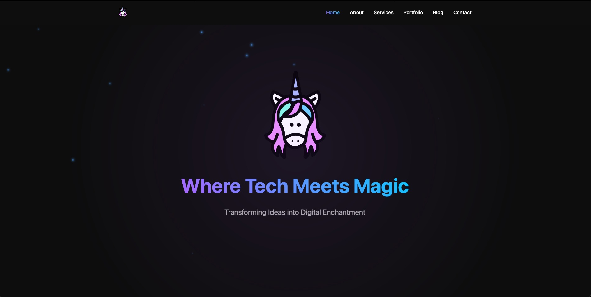

# 🦄 Magic Unicorn Tech Website

> **Where Tech Meets Magic** - A modern, animated React website template with personality and pizzazz



## 🚀 Overview

Magic Unicorn Tech is a cutting-edge website built with React and Vite that showcases how enterprise-grade technology can be wrapped in an irresponsibly cool package. This isn't your typical corporate website - it's a digital experience that combines serious functionality with magical aesthetics.

### ✨ What Makes This Special

- **🎭 Dynamic Cycling Headlines**: 25 witty headline/tagline pairs that rotate randomly on each page visit
- **🎨 Glassmorphic Design**: Modern frosted glass effects with purple gradients and glowing elements
- **⚡ Blazing Fast Performance**: Built with Vite for lightning-fast development and production builds
- **📱 Fully Responsive**: Looks stunning on everything from phones to ultrawide monitors
- **🎬 Smooth Animations**: Framer Motion powers elegant transitions and micro-interactions
- **🌟 Particle Effects**: Animated sparkles and background elements that bring the site to life

## 🛠️ Tech Stack

| Technology | Purpose | Version |
|------------|---------|---------|
| **React** | Frontend Framework | ^18.2.0 |
| **Vite** | Build Tool & Dev Server | ^4.2.0 |
| **Framer Motion** | Animation Library | ^10.12.16 |
| **React Router** | Client-side Routing | ^6.14.2 |
| **React Icons** | Icon Components | ^4.10.1 |
| **Swiper** | Touch Sliders | ^10.2.0 |

## 🎯 Key Features

### 🎲 Random Headline System
Every page refresh delivers a fresh, witty combination:
- **"Like Skunkworks — But With Pizzazz"** / *"R&D, but make it sparkle."*
- **"Digital Power Suits for Creative Assassins"** / *"Look sharp. Move fast."*
- **"Because Boring Software is a Crime"** / *"We've alerted the authorities."*

### 🎨 Visual Excellence
- **Purple & Gold Theme**: Sophisticated color palette with magical accents
- **Animated Sparkles**: Floating particles that respond to user interactions
- **Glowing Effects**: CSS-based glow effects on key elements
- **Smooth Transitions**: Every interaction feels buttery smooth

### 📐 Component Architecture
```
src/
├── components/
│   ├── Hero.jsx           # Main landing hero section
│   ├── Navbar.jsx         # Responsive navigation
│   ├── ServiceOptions.jsx # Service showcase grid
│   ├── Footer.jsx         # Site footer
│   └── LazyImage.jsx      # Optimized image loading
├── pages/
│   ├── Home.jsx           # Homepage with cycling headlines
│   ├── About.jsx          # Company information
│   ├── Services.jsx       # Service offerings
│   └── Contact.jsx        # Contact form
└── styles/
    └── *.css              # Component-specific styling
```

## 🚀 Quick Start

### Prerequisites
- Node.js 16+
- npm or yarn

### Installation

```bash
# Clone the repository
git clone https://github.com/MagicUnicornInc/magicunicorn.tech.git
cd magicunicorn.tech

# Install dependencies
npm install

# Start development server
npm run dev

# Build for production
npm run build
```

### Development URLs
- **Local**: http://localhost:5173
- **Network**: Accessible on your local network for mobile testing

## 🐳 Docker Deployment

### Prerequisites
- Docker
- Docker Compose

### Deploy with Single Command
```bash
# Make deploy script executable
chmod +x scripts/deploy.sh

# Run deployment
./scripts/deploy.sh
```

Or manually with Docker Compose:
```bash
docker-compose up --build -d
```

The site will be available at http://localhost:3000

### Stop the Application
```bash
docker-compose down
```

### View Logs
```bash
docker-compose logs -f
```

## 🎨 Customization Guide

### Updating Headlines
Edit the `headlinePairs` array in `/src/pages/Home.jsx`:

```javascript
const headlinePairs = [
  {
    headline: "Your Awesome Headline",
    tagline: "Your witty tagline here."
  },
  // Add more pairs...
];
```

### Theming
Primary colors and effects are defined in CSS custom properties:

```css
:root {
  --primary-purple: #b66eff;
  --accent-gold: #ffd700;
  --glow-color: rgba(182, 110, 255, 0.6);
}
```

### Animation Timing
Framer Motion animations can be customized in component files:

```javascript
// Example: Adjust hero animation timing
transition={{ delay: 0.3, duration: 0.8 }}
```

## 🏗️ Architecture Highlights

### Performance Optimizations
- **Lazy Loading**: Components load only when needed
- **Code Splitting**: Automatic route-based splitting
- **Image Optimization**: Responsive images with lazy loading
- **Bundle Analysis**: Optimized build sizes

### Accessibility Features
- **Semantic HTML**: Proper heading hierarchy and landmarks
- **ARIA Labels**: Screen reader friendly
- **Keyboard Navigation**: Full keyboard accessibility
- **Color Contrast**: WCAG AA compliant color combinations

### SEO Ready
- **Meta Tags**: Open Graph and Twitter Card support
- **Structured Data**: JSON-LD schema markup
- **Sitemap Generation**: Automatic sitemap creation
- **Analytics**: Umami Analytics integration (privacy-focused, GDPR-compliant)

## 📊 Analytics

This website uses [Umami Analytics](https://umami.is) for privacy-friendly, GDPR-compliant website analytics.

- **Analytics Dashboard**: https://umami.unicorncommander.ai
- **Privacy**: No cookies, anonymous tracking, self-hosted
- **Implementation**: Tracking script integrated in main HTML file

The Umami tracking script provides real-time insights while respecting visitor privacy and complying with GDPR regulations.

## 📊 Performance Metrics

- **Lighthouse Score**: 95+ across all categories
- **First Contentful Paint**: < 1.2s
- **Largest Contentful Paint**: < 2.5s
- **Bundle Size**: < 400KB gzipped

## 🎭 Brand Personality

This website embodies the **"Serious Tech in an Irresponsibly Cool Wrapper"** philosophy:

- **Professional** enough for enterprise clients
- **Playful** enough to stand out from boring corporate sites
- **Technically excellent** under the hood
- **Visually stunning** on the surface

## 🤝 Contributing

This template is designed to be:
- **Forkable**: Easy to customize for your own brand
- **Extensible**: Clean architecture for adding features
- **Maintainable**: Well-organized code structure

## 📜 License

Open source - feel free to use this template for your own magical projects!

## 🏢 About Magic Unicorn Unconventional Technology & Stuff Inc

We're the company that puts the "magic" in technology. Based in Charleston, we build tools so good you'll think they're cheating (they're not. Probably.).

**Contact**: aaron@magicunicorn.tech
**Website**: https://magicunicorn.tech

---

*Built with ❤️ and a healthy dose of whimsy by Magic Unicorn Unconventional Technology & Stuff Inc*

**"Don't Just Scale — Swagger While You Do It"** ✨
